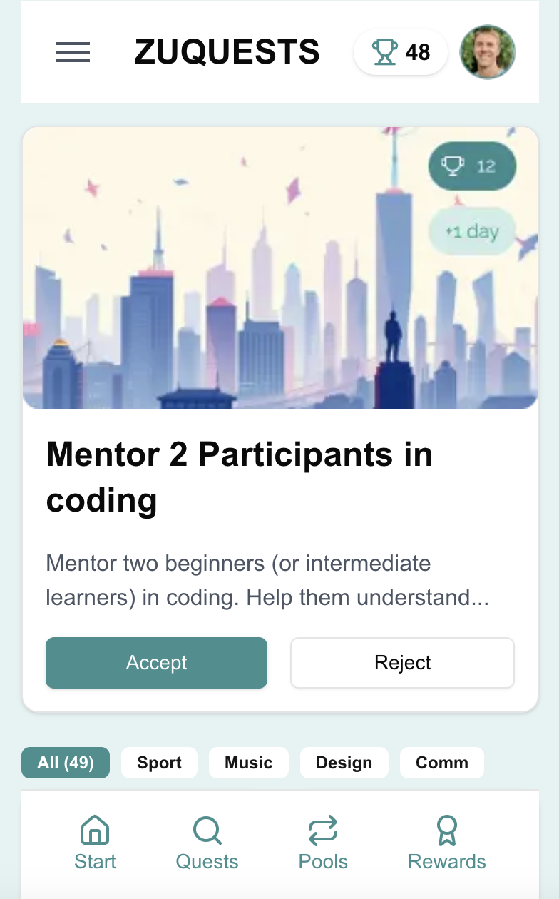
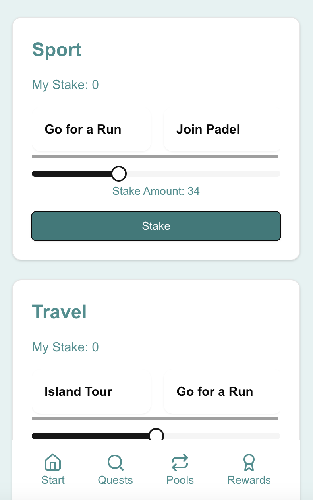

# zuQuest

## About

zuQuest is an MVP built for the [zuThailand hackathon](https://zuthailand.com). This project aims to solve coordination challenges in popup cities through a combination of interest staking, AI-driven event creation, and privacy-preserving cryptography.

### Team
- Michele: Concept & Design
- Gabin & Me: MVP Development

## Features

### 🎯 Interest Staking
- Users can stake on their interests privately using Fhenix's FHE (Fully Homomorphic Encryption) chain
- Private staking mechanism ensures user preferences remain confidential
- Note - FHE contracts and transactions are not fully implemented, but work in progress is available at: [https://github.com/tms7331/zuquest-fhenix](https://github.com/tms7331/zuquest-fhenix)

### 🔐 Arx Integration
- Arx chips are utilized for:
  - Logging in and user accounts
  - Signing transactions for the Fhenix network
- Implementation uses [libhalo](https://github.com/arx-research/libhalo), Arx Research's library for programmatic interaction with HaLo tags

### 🤖 AI-Powered Event Creation
- AI algorithms analyze community interests
- Automatically generates event suggestions based on collective preferences
- Helps optimize community engagement and participation

### 📊 Data Import & Verification
- Integration with Reclaim Protocol for secure data importing
- Users can import their LinkedIn profiles using webproofs
- Maintains privacy while verifying user credentials and experience

### Local Development
1. Node.js and npm must be installed
2. Copy `.env.example` to `.env` and fill in:
   - Supabase credentials (requires creation of a Supabase table)
   - Reclaim credentials
   - OpenAI api key
3. Install dependencies: `npm install`
4. Run the app: `npm run dev`
